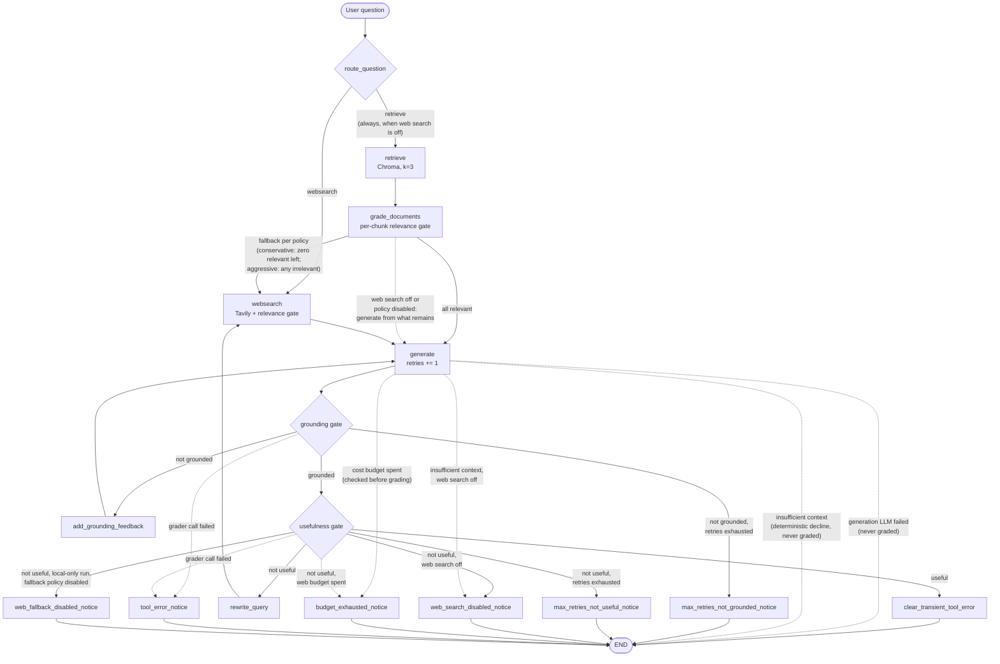

# Agentic RAG Architecture

This is the architecture deep-dive for the project. The [README](README.md)
covers setup and usage; this document describes the full workflow, state
machine, and design decisions, including the paths the README's simplified
diagram omits (terminal notice nodes and retry helpers). The *rationale*
behind the major decisions — context, trade-offs, and rejected alternatives —
lives in the Architecture Decision Records under
[docs/adr/](docs/adr/README.md).

## 1. Goal

An enterprise internal-document Q&A assistant that **never presents an
unvetted answer as a success**. Built as a self-correcting (CRAG-style)
LangGraph workflow:

- Answers come from a curated local knowledge base (Chroma) — a synthetic
  AcmeCorp internal-document corpus under `data/acmecorp_internal_docs/`
  (six fictional policy/guide documents; no real company data) — with web
  search (Tavily) as a fallback, and a privacy mode that disables web search
  entirely and suppresses LangSmith trace export.
- Every answer passes explicit quality gates (document relevance, answer
  grounding, answer usefulness).
- Failed gates trigger **meaningful retries** that change the input between
  attempts, bounded by a retry budget.
- Runs that cannot end with a passing answer record a machine-readable
  `stop_reason`, and the CLI attaches an explicit user-facing caveat.
- External dependency failures (retriever, web search, generation LLM,
  graders, query rewriter) never crash the graph: they degrade or stop
  safely with their own `stop_reason` values (see §13).

## 2. High-level architecture

Three layers, with all external clients behind lazy factories (cached only
where lifetime reuse is intentional) so every module imports side-effect-free
(no API keys, no network at import time):

| Layer | Location | Contents |
|---|---|---|
| Orchestration | `graph/graph.py` | `StateGraph` assembly, pure routing functions, `MAX_RETRIES = 5`, compiled `app` |
| Nodes | `graph/nodes/` | State-transforming steps; the only place state is written |
| Chains | `graph/chains/` | Six LCEL chains on `gpt-5-mini` (`temperature=0`): `question_router`, `retrieval_grader`, `generation`, `hallucination_grader`, `answer_grader`, `query_rewriter` |

Supporting modules: `graph/state.py` (the state schema), `graph/consts.py`
(node names, `stop_reason` values, the `WEB_SEARCH_SOURCE` metadata marker),
`graph/config.py` (env-driven flags), `graph/engine.py` (the canonical
programmatic entry point: `answer_question()` / `AnswerOptions` /
`AnswerResult`, plus `seed_state()` — the single state-seeding helper used by
the CLI, the eval harness, and tests — and the lightweight per-run
observability: `run_id`, executed node path, per-step timings, total
duration, and an optional metadata-only trace JSON via
`AnswerOptions.trace_path`; collected centrally by streaming the compiled
graph's node updates (`stream_mode="updates"`), merged onto the seeded state
— GraphState has only last-value channels, so this reproduces `invoke()`
exactly and tracing can never change behavior). The same streamed node boundary
is the cooperative-cancellation seam: `AnswerOptions.cancel_event` is checked
after each completed node; cancellation raises `RunCancelled`, returns
no `AnswerResult`, trace, history record, or new `stop_reason`, and never
interrupts a provider call already in flight (ADR 017 and §14).
`graph/formatting.py` (shared
presentation: stop-reason caveats + Sources section), `ingestion.py`
(offline, idempotent Chroma build of the local Markdown corpus: collection
reset + deterministic chunk ids, provenance metadata per document),
`main.py` (thin CLI over the engine).

**Design grammar** (applied consistently):
- Conditional edge functions are **pure** — they read state and chains, never write.
- All state writes happen in **nodes**, including tiny pass-through nodes whose
  only job is one write (feedback, rewritten query, stop reason).
- Every retry cycle passes through `generate`, which increments the `retries`
  counter that `MAX_RETRIES` caps.
- Shared string constants live in `consts.py`; user-facing presentation lives
  in `graph/formatting.py` (re-exported by `main.py` for backward
  compatibility).

## 3. GraphState

Defined in `graph/state.py` (`TypedDict`). `graph/engine.py` (`seed_state()`)
seeds every field per question — the single seeding site shared by the CLI,
the eval harness, and tests; all readers use safe defaults so partial states
behave like today's defaults.

| Field | Type | Purpose |
|---|---|---|
| `question` | `str` | The redacted runtime question. The original input is used only to compute `AnswerResult.question_sha256` and determine `input_redacted`; it is not propagated in state. Routing, retrieval, generation, grading, and web search all see the same redacted value. |
| `documents` | `List[Document]` | Working context: filtered Chroma chunks + at most one web supplement. |
| `generation` | `str` | The latest generated answer. |
| `web_search` | `bool` | Set by `grade_documents` when any retrieved chunk was irrelevant → fall back to web search. |
| `web_search_enabled` | `bool` | Effective per-run web-search gate. Resolution order is absolute deployment lock, explicit engine option, then `WEB_SEARCH_ENABLED` default. `False` = no external search or LangSmith export for that run. |
| `web_fallback_policy` | `str` | Resolved per-run fallback policy (`conservative` / `aggressive` / `disabled`), seeded once by the engine from `WEB_FALLBACK_POLICY` or a per-run option; graph decisions read it from state, never from `os.environ` mid-run. |
| `retries` | `int` | Number of generations so far; caps the quality-check loops. |
| `stop_reason` | `str` | Why the run ended early (`""` = normal finish); drives user-facing caveats. |
| `insufficient_context` | `bool` | Set by `generate` when the latest generation is the deterministic insufficient-context answer (no usable documents); `grade_generation` then skips the graders, which have nothing to verify. |
| `retry_feedback` | `str` | Corrective instruction for the next generation after a failed grounding check (`""` = none). |
| `search_query` | `str` | Rewritten web-search query for retry rounds (`""` = use the original question). |
| `llm_call_count` | `int` | Tracked LLM calls this run (generations, query rewrites, web-result grades). A budgeted operational counter, not total LLM usage — router and grader calls are not individually tracked (see §12). |
| `web_search_count` | `int` | Tavily searches this run. |
| `web_result_grading_count` | `int` | Individual web results sent to the relevance grader this run. |

## 4. Nodes

| Node | Constant | Responsibility |
|---|---|---|
| `retrieve` | `RETRIEVE` | Top-3 similarity search against the persisted Chroma collection. |
| `grade_documents` | `GRADE_DOCUMENTS` | Grade each chunk (`retrieval_grader`); keep relevant ones, set `web_search=True` if any failed. |
| `websearch` | `WEBSEARCH` | Tavily search (`tavily.TavilyClient` from `tavily-python`) + relevance gate on results (see §7); appends/replaces the web supplement, recording each contributing page's title/URL in `web_sources` metadata. |
| `generate` | `GENERATE` | Generate the answer from question + documents (+ `retry_feedback`); increments `retries`. Empty context → deterministic insufficient-context answer, no LLM call, `insufficient_context=True` (skips the graders downstream). |
| `add_grounding_feedback` | `ADD_GROUNDING_FEEDBACK` | Pass-through: writes the corrective instruction into `retry_feedback`. |
| `rewrite_query` | `REWRITE_QUERY` | Pass-through: rewrites the question into a more specific search query (`query_rewriter` chain) using the previous not-useful answer; writes `search_query`. |
| `web_search_disabled_notice` | `WEB_SEARCH_DISABLED_NOTICE` | Terminal: records `stop_reason = "web_search_disabled"`. |
| `web_fallback_disabled_notice` | `WEB_FALLBACK_DISABLED_NOTICE` | Terminal: records `stop_reason = "web_fallback_disabled"` (`WEB_FALLBACK_POLICY=disabled` blocked a local-only run's not-useful web retry). |
| `max_retries_not_grounded_notice` | `MAX_RETRIES_NOT_GROUNDED_NOTICE` | Terminal: records `stop_reason = "max_retries_not_grounded"`. |
| `max_retries_not_useful_notice` | `MAX_RETRIES_NOT_USEFUL_NOTICE` | Terminal: records `stop_reason = "max_retries_not_useful"`. |
| `budget_exhausted_notice` | `BUDGET_EXHAUSTED_NOTICE` | Terminal: records `stop_reason = "budget_exhausted"`. |
| `tool_error_notice` | `TOOL_ERROR_NOTICE` | Terminal: records `stop_reason = "tool_error"` (a grader call failed; the answer is delivered explicitly unverified). |
| `clear_transient_tool_error` | `CLEAR_TRANSIENT_TOOL_ERROR` | Terminal pass-through on the successful path: clears a stale *transient* `tool_error` once the answer has passed both gates (see §10); other reasons pass through untouched. |

## 5. Conditional routing

Three pure decision functions in `graph/graph.py`:

**`route_question`** (conditional entry point)
- When the effective `web_search_enabled` value is `true`, an LLM router picks
  `retrieve` (knowledge-base topics) or `websearch` (current/external information).
- When the effective value is `false`, routing skips the LLM and goes directly to
  `retrieve`; all web-search entry and fallback paths are unreachable.
- `PRIVACY_MODE=true` is an absolute lock: a per-run option cannot re-enable web
  search. `PRIVACY_MODE=false` only means that lock is absent; the environment
  default or a per-run option can still make the effective value `false`.

**`decide_to_generate`** (after document grading)
- All chunks relevant → `generate`.
- Any chunk irrelevant (or retrieval failed) → the effective web-search gate wins first:
  with `web_search_enabled=False`, `generate` proceeds with whatever relevant
  chunks remain (possibly none → the deterministic insufficient-context
  answer). Otherwise the per-run policy in `state["web_fallback_policy"]`
  (seeded from `WEB_FALLBACK_POLICY` or a per-run engine option; see ADR 011)
  decides:
  - `conservative` (default): `generate` when at least one relevant chunk
    remains; `websearch` only with zero relevant chunks left.
  - `aggressive` (legacy): always `websearch`.
  - `disabled`: always `generate` — local retrieval paths never escalate to
    the web.

**`grade_generation`** (after generation; eleven explicit outcomes, each
mapped one-to-one to an edge)

| Outcome | Condition | Next |
|---|---|---|
| `insufficient_context` | the generation is the deterministic insufficient-context answer (no usable documents) — nothing to verify, nothing to improve; the graders are skipped | `END` (web search off with no earlier `stop_reason`: `web_search_disabled` notice → `END`, so the caveat explains the limitation) |
| `useful` | grounded + answers the question | `clear_transient_tool_error` → `END` (clears a stale transient `tool_error`; see §10) |
| `not_grounded` | failed grounding, retries remain | `add_grounding_feedback` → `generate` |
| `not_useful` | grounded but off-target, web search enabled, retries remain | `rewrite_query` → `websearch` → `generate` |
| `web_search_disabled` | grounded but off-target, effective web-search gate off | notice node → `END` |
| `web_fallback_disabled` | grounded but off-target on a local-only run (`web_search_count == 0`) with `WEB_FALLBACK_POLICY=disabled` | notice node → `END` |
| `max_retries_not_grounded` | failed grounding at the retry limit | notice node → `END` |
| `max_retries_not_useful` | grounded but off-target at the retry limit | notice node → `END` |
| `budget_exhausted` | per-run cost budget spent (LLM-call budget, checked before grading; or web-search budget when another search round would be needed) | notice node → `END` |
| `generation_error` | the generation LLM call itself failed (the generate node recorded the stop reason and a safe placeholder answer) | `END` directly, never graded |
| `tool_error` | a hallucination/answer grader call failed — the answer cannot be verified | notice node → `END` |

Ordering details that matter:
- A **`generation_error` is checked before everything else** — a failed
  generation must never be graded, retried, or presented as a normal answer.
- The **insufficient-context bypass is checked next, before the budget** — a
  clean honest decline must not be tagged `budget_exhausted`, and an earlier,
  more specific `stop_reason` (e.g. `retrieval_error`) survives because the
  bypass routes straight to `END` instead of through a notice node.
- The **LLM-call budget is checked first among the grading paths, before the
  graders run** — a spent budget must not spend more, so the final answer
  goes out ungraded with a caveat saying exactly that.
- Otherwise, **grade first, then check the retry limit** — even the final
  allowed generation is fully graded; the cap only fires when the answer would
  otherwise loop.
- In the not-useful branch the order is **privacy → fallback policy → retry
  limit → web-search budget**: with web search disabled (or the fallback
  policy forbidding a local run's escalation), improvement was impossible
  regardless of retries, so those caveats are the accurate ones; the web
  budget stops the loop when another (unaffordable) search round would be
  required.

## 6. Full workflow

Step by step:

1. **`route_question`** — vector store vs. web search (or forced retrieval when web search is off).
2. **`retrieve`** — top-3 Chroma chunks.
3. **`grade_documents`** — per-chunk relevance grading; irrelevant chunks dropped; any failure flags a web-search fallback.
4. **`websearch`** — searches with `search_query` if a retry rewrote it, otherwise the original question. Results are defensively parsed (string error responses, malformed entries, and empty contents are skipped), then **each result is graded for relevance against the original question** — the same gate internal chunks face. Relevant contents merge into one `Document(metadata={"source": "web_search"})` whose `web_sources` metadata lists each contributing page's title/URL (page-level provenance), and which **replaces** any previous web supplement rather than stacking duplicates. Nothing usable → documents pass through unchanged.
5. **`generate`** — strict answer-from-context-only generation; `retry_feedback`, when present, is folded into the question input so a retry differs from the previous attempt. Empty context short-circuits to a fixed insufficient-context answer without calling the LLM.
6. **Grounding check** (`hallucination_grader`) — is every claim supported by the documents?
7. **Usefulness check** (`answer_grader`) — does the grounded answer actually address the question?
8. Failure routing per the table in §5.

## 7. Web-result relevance checking

External web content is the least trusted input in the system, so it does not
bypass the relevance gate that curated chunks pass through. Inside the
`websearch` node (no extra graph edges — keeping the check local avoids
creating a new, ungoverned loop):

- Each Tavily result is graded individually with the existing
  `retrieval_grader` against the **original** question (the intent), even when
  the search itself used a rewritten query.
- Irrelevant results are dropped; only relevant content reaches generation.
- Malformed responses (Tavily errors arrive as plain strings; entries can lack
  `content`) are skipped defensively — the node never crashes, and a fully
  unusable response simply leaves the documents unchanged.

Note that this gate checks **topical relevance, not safety**: an on-topic web
page can still carry prompt-injection text ("ignore previous instructions",
"reveal secrets", …) and pass the gate correctly. The generation prompt
therefore explicitly treats all retrieved context as untrusted evidence,
never as instructions — a first-line, prompt-level defense documented in
[ADR 010](docs/adr/010-prompt-injection-defense.md).

## 8. Meaningful retries

A retry is only worth its cost if something changes between attempts —
re-invoking the same chain with identical inputs at `temperature=0` mostly
reproduces the same failure. Two mechanisms guarantee a difference:

- **`not_grounded` → `add_grounding_feedback` → `generate`**: the next
  generation receives a corrective instruction ("use only explicitly supported
  facts; if the documents are insufficient, say so") folded into its input.
  The prompt template and chain input variables are unchanged.
- **`not_useful` → `rewrite_query` → `websearch` → `generate`**: the
  `query_rewriter` chain produces a more specific search query, informed by
  the previous (not useful) answer. The fresh web supplement replaces the
  stale one, so the next grounding check judges against genuinely new context.

Both helper nodes are linear pass-throughs spliced into the two pre-existing
cycles — no new decision points, so no new uncontrolled loops. Note that
`retry_feedback` persists for the remainder of the run once set: every later
generation in that run keeps the stricter instruction.

## 9. Web-search-off runs (`web_search_enabled=false`)

For runs where user questions must not reach an external search service. The
engine resolves the state value from an explicit per-run `AnswerOptions` value
or the `WEB_SEARCH_ENABLED` environment default (`false`/`0`/`no`/`off`,
case-insensitive, disables; anything else — including unset — preserves full
behavior). `PRIVACY_MODE=true` and local-provider mode then enforce an absolute
false value that no per-run option can reopen. When the effective value is
disabled:

- `route_question` always returns `retrieve` and skips the router LLM.
- `decide_to_generate` never falls back to web search; generation proceeds
  with the remaining relevant chunks (or the insufficient-context answer).
- `grade_generation` ends a grounded-but-not-useful run via the
  `web_search_disabled` notice instead of searching; the `rewrite_query` chain
  is never invoked. The deterministic insufficient-context answer ends the
  same way (without grading), unless an earlier, more specific `stop_reason`
  is already recorded.
- The `websearch` node is unreachable (verified by end-to-end tests asserting
  zero web-tool calls in worst-case scenarios).
- No LangSmith trace is exported. `graph/engine.py` wraps the graph run in
  `langsmith.tracing_context(enabled=False)`, which outranks both
  `ls.configure()` and the `LANGSMITH_*`/`LANGCHAIN_*` environment variables.
  Being execution-scoped rather than process-global, it keeps the per-run
  privacy resolution per-run (the eval harness runs private and web-enabled
  rows in one process), and covers every caller of `answer_question()` rather
  than the CLI alone. Only the disabling direction is applied — forcing
  `enabled=True` on a normal run would override an operator's deliberate
  `LANGSMITH_TRACING=false`.

Scope limit: this state stops external web search and trace export, not the
OpenAI calls themselves — the question and retrieved chunks still reach the
model provider for all four LLM steps that run in this mode:
retrieval/document grading, generation, grounding (hallucination) grading, and
answer-usefulness grading. Routing is not among them: the router LLM is
skipped entirely (see above), and it only ever receives the question, never
retrieved chunks. Closing the model path too requires swapping the provider,
which is what the local provider mode below does.

All grounding and usefulness gates remain active when web search is off, with one
principled exception in both modes: the deterministic insufficient-context
answer skips the graders — it contains no claims to verify, and regenerating
from the same empty context cannot improve it (see §5).

### Deployment mode flags (`PRIVACY_MODE`, `FULLY_LOCAL_MODE`)

Intention-named flags over the two mechanisms above, added in ADR 015. Both
default to off and reject unparseable values at startup.

* **Two enforcement layers.** `config.web_search_enabled()` lowers the *default*
  when `PRIVACY_MODE=true`; `graph/engine.py::seed_state()` applies the *lock*
  (`if privacy_mode() or local_mode_enabled(): web_search_enabled = False`).
  The lock cannot live in `graph/config.py`, because `seed_state()` consults
  that module only when the per-run option is `None` — an explicit
  `AnswerOptions(web_search_enabled=True)` would bypass it, silently turning
  the lock back into a default.
* **Resolution order.** Lock (privacy mode or local provider) → explicit per-run
  option → `WEB_SEARCH_ENABLED` default.
* **`WEB_SEARCH_ENABLED` is unchanged**, deliberately: still a
  per-run-overridable default with lenient value parsing, because the eval
  harness runs privacy rows and web rows in the same process.
* **`FULLY_LOCAL_MODE=false` asserts nothing** — `LLM_PROVIDER` stays in
  control. Only `FULLY_LOCAL_MODE=true` + `LLM_PROVIDER=openai` raises.
* **Startup validation.** `main.py::run_startup_preflight()` (renamed from
  `run_local_mode_preflight()`) validates both flags and the provider in every
  mode, then checks that the active provider's index exists — also in every
  mode — before the local-only checks, so an invalid value becomes a
  `PreflightError` rather than a raw traceback in the CLI or a swallowed
  per-row failure in the eval harness. `--validate-only` still bypasses it.

### Local provider mode (`LLM_PROVIDER=ollama`) — experimental

A process-level deployment mode that routes all six chains and both embedding
call sites to an Ollama-compatible endpoint. It composes with privacy mode
rather than replacing it.

* **Seams.** One `graph/chains/_llm.py::get_chat_model()` serves every chain
  (replacing six identical inline `ChatOpenAI(...)` constructions);
  `ingestion.py::get_embeddings()` serves both embedding sites. Both stay lazy;
  the shared chat-model factory is cached, while embeddings are constructed on
  demand and the active provider's retriever is process-cached. The local
  provider package is imported only when local mode is selected, so imports
  remain side-effect-free.
* **The one runtime-policy change.** `seed_state()` resolves
  `web_search_enabled` to `False` whenever local mode is active, and a per-run
  `AnswerOptions(web_search_enabled=True)` cannot override it. Tavily becomes
  unreachable through the existing privacy paths and the
  `tracing_context(enabled=False)` guard already keyed off that flag suppresses
  LangSmith export. A local-mode run therefore traverses the **existing**
  privacy path — nothing is added to or removed from the graph, and no node,
  routing function, `stop_reason`, or `GraphState` field changed.
* **Fail-fast configuration.** `llm_provider()` raises on an invalid non-empty
  value instead of falling back, unlike `normalize_web_fallback_policy()`.
  Every policy value is a benign variation; a mistyped provider is a silent
  privacy failure.
* **Provider-scoped indexes.** OpenAI keeps `chroma_db/` /
  `agentic_rag_docs`; local mode uses `chroma_db_local/` /
  `agentic_rag_docs_local`. `delete_collection()` during the idempotent rebuild
  is scoped to the active provider, so neither ingest can destroy the other's
  index, and switching between two already-built matching indexes needs no
  re-ingestion. A sidecar `embedding_fingerprint.json` records provider +
  model; a missing fingerprint means legacy-OpenAI (accepted in OpenAI mode, a
  mismatch in local mode).
* **Startup preflight, outside the graph.** `main.py` checks the provider
  value, endpoint reachability, both installed models (reported individually),
  and index presence + fingerprint match, then prints a mode banner. Of these,
  only the endpoint, installed-model, and fingerprint checks are
  local-mode-only — index presence is checked in OpenAI mode too.
  `evals/run_eval.py` calls the same helpers *after* its `--validate-only`
  early return, so dataset validation stays keys-free and never imports the
  graph. Preflight lives outside the graph because ADR 006 requires in-graph
  failures to degrade rather than crash; checking first keeps both graceful
  degradation and an actionable message.
* **Boundary.** No third-party egress — not "nothing leaves the machine":
  `OLLAMA_BASE_URL` may point at private infrastructure. See ADR 014.

## 10. stop_reason and user-facing caveats

Terminal notice nodes record *why* a run ended without a passing answer;
`graph/formatting.py` maps each reason to a caveat appended after the answer
(`STOP_REASON_NOTES`; `main.py` re-exports the names). Successful answers are
printed without any caveat, in both modes.

| `stop_reason` | Meaning | User-facing caveat (summary) |
|---|---|---|
| `""` | Both gates passed | none |
| `web_search_disabled` | Grounded but off-target; web search unavailable | "Web search is disabled… answer limited to the local knowledge base." |
| `web_fallback_disabled` | Grounded but off-target; `WEB_FALLBACK_POLICY=disabled` forbids escalating a local-only run to the web | "Web fallback is disabled by policy… answered only from the local knowledge base." |
| `max_retries_not_grounded` | Retry limit hit; answer still failed grounding | "Did not pass the anti-hallucination check… do not treat as fully reliable." |
| `max_retries_not_useful` | Retry limit hit; grounded but still off-target | "Grounded but may not fully answer your question." |
| `budget_exhausted` | Per-run cost budget spent before the gates passed | "Stopped because the per-run cost/latency budget was reached… may be incomplete or not fully verified." |
| `retrieval_error` | Chroma / retriever failed; run degraded (web fallback or insufficient-context answer) | "Local document retrieval failed… answer may be incomplete or unavailable." |
| `web_search_error` | Tavily search failed; run continued with local documents only | "Web search failed, so I answered only from the local knowledge base…" |
| `generation_error` | The generation LLM call failed; a safe placeholder answer was returned, never graded | "The language model call failed before a reliable answer could be generated." |
| `tool_error` | A grader or the query rewriter failed; content was dropped ungraded or verification was skipped | "An internal step failed… answer may be incomplete or not fully verified." |

Degraded-run reasons persist to the end of the run with one deliberate
exception: a **transient `tool_error`** written by a mid-run node (a dropped
chunk/result, a failed query rewrite — situations the run recovers from) is
cleared by the `clear_transient_tool_error` pass-through when the final
answer passes both quality gates, so a fully successful answer never carries
an error caveat. Whole-source degradations (`retrieval_error`,
`web_search_error`) persist even on success — an entire evidence source was
unavailable, which the user should see — and the terminal `tool_error`
(verification itself failed, recorded by `tool_error_notice`) always ends the
run flagged. Terminal notice nodes overwrite an earlier reason when a later
failure ends the run — the reason that actually stopped the run wins. Nodes
only write `stop_reason` on failure, so a successful step never clobbers an
earlier recorded reason (the success-path cleanup node is the one deliberate
exception).

### Answer provenance (Sources section)

After the caveat (if any), the CLI appends a deterministic `Sources:`
section built by `format_sources(result["documents"])` (`graph/formatting.py`)
— pure post-run formatting of `Document` metadata, never an LLM call, never
document content (the engine exposes the same lines as
`AnswerResult.sources`):

- **Local corpus documents** (anything not marked as the web supplement) are
  cited as `- Local corpus: <title>` (falling back to the `source` path, then
  to the safe label `Local corpus document`). Titles come from each corpus
  document's H1 heading; `ingestion.py` also records `source` (repo-relative
  path), `source_type: "local_corpus"`, and a `document_category`, all
  persisted through chunking into Chroma.
- **The web supplement** is detected via `metadata["source"] ==
  WEB_SEARCH_SOURCE` (a constant in `consts.py` shared with the `websearch`
  node, which also records `source_type: "web"`, the `search_query` that
  produced the supplement, and `web_sources` — one `{"title", "url"}` entry
  per relevant result with a usable URL, deduplicated by URL). Citation is
  page-level when URLs are known: `- Web search: <title> — <url>` per page
  (bare URL when the title is missing); the fallback chain is the
  query-level `- Web search: "<query>"`, then `Web search result`. Only
  results that passed the relevance gate are cited.
- Duplicate lines are collapsed order-preservingly (several chunks of one
  page cite it once); an empty document list produces no section at all.
- Caveat ordering: the stop-reason caveat is printed *before* the sources,
  so a sources list next to an error never implies the answer was verified.

## 11. Retry exhaustion

`MAX_RETRIES = 5` caps total generations per question. Because the limit is
checked **after** grading, the fifth generation still gets the full two-gate
check — the protective stop only replaces a sixth loop iteration. The two
exhaustion outcomes are distinguished (`max_retries_not_grounded` vs.
`max_retries_not_useful`) because they require different user warnings: the
former may contain unsupported content; the latter is grounded but incomplete.

## 12. Per-run cost / latency budget

Three counters in state track spend; three env-configurable budgets
(`graph/config.py`) cap it. Increments happen only in nodes (where state
writes are legal); checks are pure reads:

| Budget (env var) | Default | Counts | Checked where | On exhaustion |
|---|---|---|---|---|
| `MAX_LLM_CALLS_PER_RUN` | 30 | generations (not the empty-context short-circuit), query rewrites, web-result grades | top of `grade_generation`, **before** the graders run | `budget_exhausted` → notice → `END` |
| `MAX_WEB_SEARCHES_PER_RUN` | 5 | actual Tavily calls | `grade_generation` not-useful branch (stops pointless loops) + a defensive guard inside `websearch` (skips the search, documents unchanged) | `budget_exhausted` / skip |
| `MAX_WEB_RESULTS_TO_GRADE` | 15 | individual results sent to the relevance grader | inside `websearch`'s grading loop | remaining results dropped ungraded and unused; run continues |

Deliberate accounting tradeoff: hallucination/answer-grader calls run inside a
conditional *edge* (which cannot write state) and are bounded at two per
generation, so they are not individually counted — capping counted calls
transitively caps them. `grade_documents`' per-chunk grades (≤ k = 3, once per
run, outside every loop) and the router call are likewise uncounted. In other
words, **`llm_call_count` is a tracked operational counter, not total LLM
usage**: it understates real API calls by a bounded factor — adequate as a
budget backstop and for relative observability (the eval report labels it
"tracked LLM calls"), inadequate for billing. True cost accounting would use
tracing/token usage rather than manual counters. Defaults sit above the worst
case the `MAX_RETRIES` loop can produce, so the budgets never bind unless
explicitly tightened; invalid or non-positive env values fall back to the
defaults so a budget can never be accidentally disabled.

## 13. External dependency failure handling

Every external call is wrapped in a `try/except Exception` at its existing
seam. The design rules:

- **Failures in nodes write `stop_reason` directly** (nodes are the only
  legal state writers). Failures inside the pure `grade_generation` edge
  return a dedicated outcome routed to the `tool_error_notice` node instead.
- **Console banners log only the exception type** (e.g.
  `---WEB SEARCH FAILED (TimeoutError): ...---`) — never the message, which
  could carry secrets, keys, or paths.
- **Ungraded content is never trusted**: a relevance-grader failure drops the
  affected chunk/result; a hallucination/answer-grader failure ends the run
  with the answer explicitly flagged unverified.
- **Failed attempts still count against budgets** (a failed Tavily call
  increments `web_search_count`; failed LLM calls increment
  `llm_call_count`), so a persistently failing dependency cannot drive an
  unbounded retry loop.

Per dependency:

| Failure | Reaction | Continues? |
|---|---|---|
| Retriever / Chroma (`retrieve`) | Empty documents + `web_search=True` → degrade to web fallback (web search off: deterministic insufficient-context answer); `grade_documents` preserves the incoming flag | yes |
| Tavily (`websearch`) | Local documents only (stale web supplement already dropped); attempt budgeted | yes |
| Generation LLM (`generate`) | Safe placeholder answer + `generation_error`; `grade_generation` routes straight to `END` — never graded | no |
| Query rewriter (`rewrite_query`) | `search_query=""` → next search uses the original question; loop stays fully gated | yes |
| Retrieval grader (`grade_documents` / `websearch`) | Ungraded chunk/result dropped; remaining items still graded; web fallback requested for dropped local chunks | yes |
| Hallucination / answer grader (`grade_generation`) | `tool_error` → notice node → `END`; answer delivered explicitly unverified | no |
| Question router (`route_question`) | Route to `RETRIEVE` (the destination used when web search is off) — no `stop_reason`: the entry point is a pure edge with no node ahead of it to record one | yes |

The effective web-search gate holds on every failure path (a retrieval failure
with web search off still never calls the router, Tavily, or the rewriter).

## 14. Web application layer (`server/` + `frontend/`)

A second entry point onto the same engine, added without touching the graph.
The full rationale — including why the server reports resolved values instead
of recomputing them — is [ADR 016](docs/adr/016-thin-web-application-layer.md).

**`server/` is an adapter, not a second application.** It imports only
`graph.engine`, `graph.config`, `graph.consts`, `graph.formatting`,
`ingestion`, and `main`; it never imports `graph.nodes.*` or the chain
factories, and it constructs no LLM, embedding, Chroma, or Tavily client, so
`import server.app` stays side-effect-free and keys-free like every other
module.

| Module | Responsibility |
|---|---|
| `server/app.py` | `create_app()`, the endpoints, error mapping, the lifespan preflight, and an optional repository-relative `frontend/dist` static mount (API-only mode when absent) |
| `server/schemas.py` | Pydantic request/response models — the API contract the frontend's `api/types.ts` mirrors |
| `server/runs.py` | `RunStore`: `deque(maxlen=RUN_HISTORY_LIMIT = 50)` + `threading.Lock` + a `run_id` index |
| `server/status.py` | Resolved runtime status and the index-compatibility ladder |
| `server/documents.py` | Keys-free corpus listing (filesystem + fingerprint sidecar only) |

| Endpoint | Behavior |
|---|---|
| `POST /api/ask` | Sync `def` (threadpool) → `engine.answer_question()` with a `cancel_event`; builds citations from `raw_state["documents"]` (300-char snippets, deduplicated) and appends a metadata-only history record |
| `POST /api/ask/cancel` | Sets the in-flight run's event, waits for the ask lock, returns `{cancelled, idle}` (ADR 017) |
| `GET /api/status` | Resolved provider/mode, budgets, timeout, index compatibility, preflight result |
| `GET /api/documents` | Corpus metadata + the same index block; works with no keys and no network |
| `GET /api/runs`, `GET /api/runs/{run_id}` | Newest-first summaries and run detail, or 404 |

Design points that carry the guarantees across the HTTP boundary:

* **Resolved values are reported, never recomputed.** `AnswerResult` already
  carries the `web_search_enabled` / `web_fallback_policy` the run actually
  used (privacy lock included, §9), so the API echoes them. `web_search_locked`
  on `/api/status` is a display flag only — the lock itself stays in
  `engine.seed_state()`.
* **A `stop_reason` is never an HTTP error.** All nine values return 200 with
  the same `STOP_REASON_NOTES` caveat the CLI prints (§10). HTTP errors are
  reserved for HTTP-layer problems: 422 validation, 409 `run_in_progress`, 503
  `preflight_failed` / `config_error`, 404 `run_not_found`, 499
  `run_cancelled`, and 500 `internal_error` carrying the exception **type**
  only — the same logging rule as §13.
* **Single in-flight ask.** Thread safety of the cached chains, retriever, and
  compiled graph is unverified here, so `app.state.ask_lock` is acquired
  non-blocking and a concurrent question gets 409 without the engine being
  touched. Read-only endpoints are not serialized.
* **Metadata-only history.** Each record is `engine.build_trace(result)` plus
  `provider` and a derived `status` (`ok` / `caveat` / `error`) — no answer
  text, snippets, `page_content`, prompts, or raw state. A record exists only
  when the engine *returned* a result, degraded runs included; HTTP-layer
  failures and cancellations are reported live and never stored. History is
  lost on restart and is not shared across workers, so uvicorn runs
  single-process.
* **Preflight runs once, at startup, and does not block startup.** A
  `PreflightError` is printed to the server console (as the CLI does) and
  recorded on `app.state`; `/api/status` and `/api/documents` keep serving and
  report it, while `/api/ask` returns 503 until the configuration is fixed and
  the process restarted.
* **Index compatibility mirrors preflight** (`missing_index` →
  `legacy_no_fingerprint` → `provider_mismatch` → `model_mismatch` →
  `compatible`, plus `index_unreadable`), including the asymmetry from §9: a
  missing fingerprint is legacy-OpenAI in OpenAI mode and a reindex trigger in
  local mode. Preflight raises rather than returning a verdict, so this is
  mirrored logic and a known maintenance coupling (ADR 016).
* **Sanitized payloads.** No response contains an endpoint URL or hostname
  (notably not `OLLAMA_BASE_URL`), an absolute filesystem path, or a raw
  exception message; `persist_directory` / `collection_name` are the
  repo-relative constants from `active_index_config()`.

**`frontend/`** is Vite + React + TypeScript with three views (Ask, Documents,
Runs), plain CSS, and no router, state, or UI library. It renders only what the
API reported — a failing `/api/status` produces an explicit "backend
unreachable" state rather than defaults. The mock/real client switch is the
module constant `USE_MOCKS` in `src/api/client.ts` (no `VITE_*` variable), and
fixtures are typed with `api/types.ts` so mock/real drift is a compile error.
There is no token/step streaming: `answer_question()` returns after the run, so
the execution timeline renders post-hoc.

## 15. Testing overview

| Suite | What it covers | External calls |
|---|---|---|
| `tests/node/` | Each node's state in/out behavior, generation context formatting and no-document short-circuit behavior, the web-result relevance gate, defensive Tavily parsing, and graceful degradation when each node's external dependency raises | None — every dependency mocked at its lazy factory seam |
| `tests/graph/` | Graph routing and compiled runs, privacy and fallback behavior, stop reasons and budgets, failure degradation and caveat formatting, engine/CLI behavior, ingestion/provenance pure helpers, and import side-effect purity | None — fully mocked |
| `tests/chains/` | Five live-model modules covering generation, retrieval grading, question routing, hallucination grading, and answer grading. Query rewriting currently has no live integration module. | **Real OpenAI API** — every test is gated by the `requires_openai` marker; do not run without explicit approval |
| `tests/evals/` | The eval harness's pure helpers: dataset loading/validation (incl. the shipped dataset), per-row checks, metrics, report rendering | None — pure functions |
| `tests/server/` | The FastAPI layer (§14): ask shape and citation building, cancellation, status/index compatibility and sanitization, documents listing, run store bounds and 404s, and the full error map | None — `graph.engine.answer_question` is monkeypatched; no keys, no network |
| `tests/test_env_isolation.py` | Root-level regression that deployment/provider variables from a developer environment cannot decide mocked-test assertions | None |

Separate from the test suites, `evals/` holds a **behavioral eval harness**:
a 24-question JSONL dataset (local-corpus / web-fallback /
insufficient-context / privacy-mode / multi-document / policy-fallback categories) run through the real compiled
graph by `evals/run_eval.py`, scored with deterministic checks (stop reasons,
source provenance including local title checks, counters including web-search-count expectations, expected substrings, and effective fallback-policy echoes) and reported to
`evals/results.md`. The harness runs each row through
`graph.engine.answer_question()` — the same entry point `main.py` uses — so
state seeding is never duplicated; privacy-mode rows pass
`web_search_enabled=False` per run (no env mutation) and hard-assert
`web_search_count == 0`, and rows may optionally pin a per-row
`web_fallback_policy`. The full run needs real API keys and is deliberately
excluded from CI; `--validate-only` checks the dataset with no API calls.

Run all keys-free Python tests with
`uv run pytest tests/ --ignore=tests/chains/ -q`
(provider-backed chain tests excluded). The frontend's critical-state suite runs separately
with `cd frontend; npx vitest run`.

## 16. Known limitations & future improvements

Limitations (deliberate scope):

* Single-turn; no conversation memory, in the CLI or the web app.
* The web layer (§14) is single-user: no authentication, one in-flight
  question at a time, in-memory run history lost on restart, and no
  token/step streaming.
* Observability currently has two layers: LangSmith tracing can be enabled via environment variables for full LangChain/LangGraph trace inspection, and the engine records lightweight CI-safe metadata (`run_id`, node path, per-node timings, total duration, counters, stop reasons, and optional trace JSON). However, console logging is still `print()`-based, there is no structured logging or metrics backend, and the documentation does not yet include trace screenshots or trace-link evidence.
* Sequential per-chunk / per-result grading (latency and cost scale with k).
* Grounding feedback is a fixed instruction; the grader returns no rationale about *which* claims were unsupported.
* Prompt-injection defense is prompt-level only (ADR 010): no injection detection, content sanitization, or domain allowlisting; generation has no tools to call, which limits but does not eliminate the impact of injected instructions.

Future improvements (rough priority): structured logging and metrics-friendly observability; README/report evidence for LangSmith traces; grader-scored (LLM-as-judge) metrics on top of the deterministic eval harness; rationale-bearing grounding feedback; batched grading.

GitHub Actions CI (`.github/workflows/ci.yml`) runs three parallel jobs on every push and pull request — all keys-free:

* **`mocked-tests`**: aggregate collection of `tests/` except `tests/chains/`, including node, graph, eval-helper, server, and root-level tests; the key-gated chain suite and the full eval run are excluded.
* **`lint`**: `ruff check`, `ruff format --check`, and `mypy` (scoped to the engine-API surface — `graph/engine.py`, `graph/config.py`, `graph/formatting.py`, `graph/state.py`, `graph/consts.py` — plus the five `server/*.py` modules).
* **`frontend`**: `tsc --noEmit`, `vitest run`, and `vite build`.
